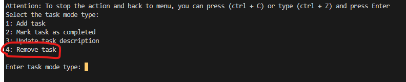
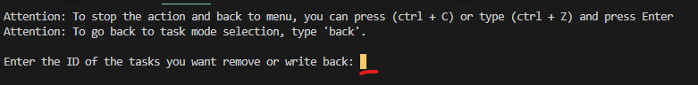
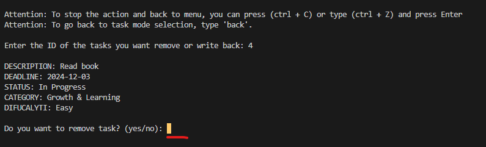
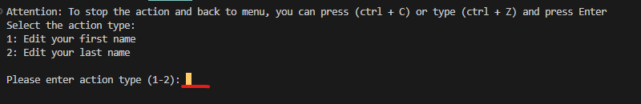

# MotivationApp

The MotivationApp is designed to help you stay focused, achieve your goals, and maintain high levels of motivation. Whether you're working on Everyday Essentials, Growth & Learning, or staying on top of your Health & Fitness routine, the app provides the tools and support you need to stay on track.

## Features

- Task Management: Create, update, mark tasks as completed, or remove tasks from your list.
- View All Tasks: View all tasks in the system, whether completed or pending.
- View To-Do Tasks: See tasks that require attention, helping you prioritize your work.
- Profile Management: Edit or create a new profile to track your goals and progress.
- View Profile: Access your profile to monitor motivation and track progress.
- View Items: Browse items available for purchase to enhance your motivation and progress.
- Buy Items: Purchase specific items to reward yourself and see your progress while staying motivated.
- Submit feedback: Report issues and provide feedback to help improve the app experience.

## Installation

- **Clone the Repository**:
  git clone https://github.com/TuringCollegeSubmissions/mbieli-WD.1.4.4.git

## Setting Up Environment Variables

1. **Create a `.env` File**:
   - In the root directory, create a new file named `.env`.
2. **Add Your Environment Variables**:

   - Open the `.env` file in a text editor and add environment variables in the following format:

   ```
    GMAIL_USER=""
    # Replace with your actual Gmail email address.

    GMAIL_APP_PASSWORD=""
    # Create app password at https://myaccount.google.com/apppasswords. Google create password like this "asd asd". You should use it all together like this "asdasd"
    # Attention: If you cannot access the page https://myaccount.google.com/apppasswords, you need to enable two-factor authentication on your Google account.

   ```

## Requirements

- **Python Version**: 3.13.0
- **Packages**:
  - `pytest`: 8.3.3 - A testing framework for Python.
  - `pip`: 24.3.1 - The package installer for Python, used to install and manage packages.
  - `tabulate`: 0.9.0 - A Python library used to generate well-formatted and visually appealing tables.
  - `python-dotenv`: 0.9.0 - A Python library used to load environment variables from `.env` files into the environment.
  - `prompt_toolkit`: 0.9.0 - A Python library for building sophisticated command-line interfaces with features like autocompletion and syntax highlighting.

## Running the Program

- **Open your terminal and run the following command:**

```
pip install -r requirements.txt  # Install the required packages listed in the requirements.txt file, if not already installed.
py main.py
```

## Running Tests

- **Navigate to the `tests` directory in your terminal and run the following command:**

```
pytest test_helpers.py
```

## Description of Folders and Files

### `/data`

- **Files**:
  - `items.csv`: A CSV file containing items data.
  - `profile.csv`: A CSV file containing profile-related data generated by the application.
  - `tasks.csv`: A CSV file containing task-related data generated by the application.

### `/images`

- **Files**:
  - `*`: Screenshots that demonstrate how to use the app.

### `modules/`

- **Files**:
  - `menu.py`: This module manages the main menu to navigate between application modes.
  - `submit_feedback.py`: This module handles the submission of user feedback and sending it via email within the application.

### `modules/file_operations`

- **Files**:
  - `items_file_handler.py`: This module handles file operations related to item data.
  - `profile_file_handler.py`: This module handles file operations related to profile data.
  - `task_file_handler.py`: This module handles file operations related to task data.

### `modules/items_managment`

- **Files**:
  - `buy_item.py`: This module handles operations related to purchasing items.
  - `view_items.py`: This module handles operations related to viewing items data.

### `modules/profile_managment`

- **Files**:
  - `manage_profile.py`: This module handles operations related to managing profile data, such as creating, updating profile.
  - `view_profile.py`: This module handles operations related to viewing profile data.

### `modules/task_management`

- **Files**:
  - `add_task.py`: This module handles operations related to adding new tasks, such as creating tasks.
  - `manage_tasks.py`: This module handles operations related to managing tasks, such as adding, removing, updating tasks.
  - `remove_task.py`: This module handles operations related to removing tasks, such as deleting tasks from the system.
  - `update_task.py`: This module handles operations related to updating task details, such as modifying task statuses or descriptions.
  - `view_tasks.py`: This module handles operations related to viewing tasks data.

### `tests/`

- **Files**:
  - `__init__.py`: This module makes the `tests` directory a package, allowing for organized imports of test modules.
  - `test_helpers.py`: This module contains test specifically for the `helpers.py` module.

### `utils/`

- **Files**:
  - `config.py`: This module contains configuration settings.
  - `descriptions.py`: This module contains descriptive information, including dictionaries for menu, task, profile.
  - `helpers.py`: This module contains helper functions used throughout the application.
  - `types.py`: This module defines types used in the application.

### `utils/enums`

- **Files**:
  - `item_enm.py`: Enumerations related to items.
  - `menu_enm.py`: Enumerations related to menu options.
  - `profile_enm.py`: Enumerations related to profiles.
  - `task_enm.py`: Enumerations related to tasks.

### `/`

- **Files**:
  - `.gitignore`: A file that tells Git to ignore the .env file and prevent it from being tracked in version control.
  - `architecture.dio`: A diagram representing the architecture of the application. If the file is not visible, you may need to install the (https://marketplace.visualstudio.com/items?itemName=hediet.vscode-drawio)
  - `main.py`: The main entry point for running the application.
  - `README.md`: A markdown file providing an overview and instructions for the application.
  - `requirements.txt`: A file that contains a list of all the dependencies and their versions required for the project
  - `wd_1_3_4.ipynb`: A Jupyter notebook containing the task description and requirements.

## Examples of How Each Functionality Works

### Task Management mode

#### **Add task**

1. Select option "Manage tasks".

   

2. Select option "Add task".

   

3. Select a task category (1-3). Each category represents your progress in profile. For example, you can choose the "Everyday Essentials" category.

   

4. Create a description: The description cannot be empty.

   

5. Set a deadline: The deadline cannot be empty and must not be later than today.

   

#### **Mark task as completed**

1. Select option "Manage tasks".

   

2. Select option "Mark task as completed".

   

3. Enter the Task ID: The ID cannot be empty, the task status cannot be 'Completed,' and the task must exist.

   

4. Confirm the changes.

   

#### **Update task description**

1. Select option "Manage tasks".

   

2. Select option "Update task description".

   

3. Enter the Task ID: The ID cannot be empty, and the task must exist.

   

4. Edit the description: If the description is left empty, the existing text will remain unchanged. If no changes are made and you press Enter, the text will stay the same.

   

5. Confirm the changes.

   

#### **Remove task**

1. Select option "Manage tasks".

   

2. Select option "Remove task".

   

3. Enter the Task ID: The ID cannot be empty, and the task must exist.

   

4. Confirm the changes.

   

### View all tasks

1. Select option "View all tasks".

   

### View todo tasks

1. Select option "View todo tasks".

   

### Manage profile

#### **Create portfolio**

- Shows if a portfolio hasn’t been created.
- If you complete a task but don't have a portfolio, a demo portfolio will be automatically created.

1. Select option "Manage profile".

   

2. Enter your first name.

   

3. Enter your first name.

   

#### **Edit portfolio**

- Shows if you have a portfolio

1. Select option "Manage profile".

   

2. Select what you want to edit.

   

3. Confirm the changes.

   

### View profile

1. Select option "View profile".

   

### View items

1. Select option "View items".

   

### Buy items

1. Select option "Buy items".

   

2. Write item ID: The ID cannot be empty, and the item must exist.

   

3. Confirm if you want to buy the item.

   

### Submit feedback

1. Select option "Submit feedback".

   

2. Write the feedback message: The message cannot be empty.

   

3. Confirm if you want to send the feedback.

   
